# Pipeline as a Service Stack

Reusable GitHub Actions workflow (`workflow_call`) that centralizes Terraform validation across all infrastructure projects. Consumers invoke a single workflow reference — all stages, caching, SARIF reports, and summary reporting are handled internally.

---

## What's Included

| Stage | Tool | Feature Flag | Description |
|-------|------|-------------|-------------|
| 1 | **terraform fmt** | Always | Code formatting (recursive) |
| 2 | **TFLint** | `enable_tflint` | Linting & best practices |
| 3 | **tfsec** | `enable_tfsec` | Security scanning (SARIF to GitHub Security tab) |
| 4 | **Checkov** | `enable_checkov` | Policy compliance (SARIF to GitHub Security tab) |
| 5 | **terraform-docs** | `generate_tfdocs` | Documentation generation with drift detection + PR comment |
| 6 | **Validation Summary** | Always | Consolidated status table in GitHub Step Summary |
| — | **tf-cost** | _coming soon_ | Cost estimation (infracost / cloud.tf — not yet implemented) |

---

## Quick Start

### Basic Usage
```yaml
jobs:
  validate:
    uses: orafaelferreiraa/pipeline-as-a-service-stack/.github/workflows/pipeline-core.yaml@main
    with:
      terraform_dir: terraform
      terraform_version: '~1.9.0'
```

### Full Features
```yaml
jobs:
  validate:
    uses: orafaelferreiraa/pipeline-as-a-service-stack/.github/workflows/pipeline-core.yaml@main
    secrets: inherit
    permissions:
      contents: read
      pull-requests: write
      security-events: write
    with:
      terraform_dir: terraform
      terraform_version: '~1.9.0'
      enable_tflint: true
      enable_tfsec: true
      enable_checkov: true
      generate_tfdocs: true
      soft_fail: false
```

---

## Input Parameters

| Input | Type | Default | Description |
|-------|------|---------|-------------|
| `terraform_dir` | string | `terraform` | Terraform working directory |
| `terraform_version` | string | `~1.9.0` | Terraform version |
| `enable_tflint` | boolean | `true` | Run TFLint linting |
| `enable_tfsec` | boolean | `true` | Run tfsec security scan |
| `enable_checkov` | boolean | `true` | Run Checkov policy scan |
| `generate_tfdocs` | boolean | `true` | Generate terraform-docs and check drift |
| `soft_fail` | boolean | `false` | Continue pipeline on validation errors |

### Required Permissions

The caller workflow must grant:

```yaml
permissions:
  contents: read
  pull-requests: write
  security-events: write
```

---

## Pipeline Stages

```
┌──────────────┐    ┌──────────────┐    ┌──────────────┐    ┌──────────────┐
│ terraform    │───►│   TFLint     │───►│    tfsec     │───►│   Checkov    │
│    fmt       │    │  (optional)  │    │  (optional)  │    │  (optional)  │
└──────────────┘    └──────────────┘    └──────────────┘    └──────────────┘
                                                                    │
                    ┌──────────────┐    ┌──────────────┐            │
                    │  Validation  │◄───│ terraform    │◄───────────┘
                    │   Summary    │    │    docs      │
                    └──────────────┘    └──────────────┘
```

Stages run **sequentially** with `continue-on-error: true` and `if: always()` gates — every stage executes regardless of prior failures. The final **Validation Summary** consolidates all outcomes into a GitHub Step Summary table.

---

## 🏗️ Pipeline Architecture

### Execution Flow

```mermaid
flowchart TD
    A["📤 PR Opened / Manual Trigger"] --> B["🚀 workflow_call invoked"]
    B --> C["<b>Stage 1: terraform fmt</b><br/>Code formatting"]
    C --> D{"✅ Pass?"}
    D -->|Yes| E["<b>Stage 2: TFLint</b><br/>Linting & best practices<br/><i>feature_flag: enable_tflint</i>"]
    D -->|No| Z["❌ Summary: Format Failed"]
    E --> F{"✅ Pass?"}
    F -->|Yes| G["<b>Stage 3: tfsec</b><br/>Security scanning<br/><i>feature_flag: enable_tfsec</i>"]
    F -->|Skip| G
    G --> H{"✅ Pass?"}
    H -->|Yes| I["<b>Stage 4: Checkov</b><br/>Policy compliance<br/><i>feature_flag: enable_checkov</i>"]
    H -->|Skip| I
    I --> J{"✅ Pass?"}
    J -->|Yes| K["<b>Stage 5: terraform-docs</b><br/>Drift detection<br/><i>feature_flag: generate_tfdocs</i>"]
    J -->|Skip| K
    K --> L{"docs<br/>changed?"}
    L -->|Yes| M["💬 Post PR Comment<br/>w/ regenerate instructions"]
    L -->|No| N["✅ Validation Summary"]
    M --> N
    Z --> O{"soft_fail<br/>enabled?"}
    O -->|No| P["🛑 Pipeline Blocked"]
    O -->|Yes| Q["⚠️ Warning Only"]
    N --> R["✅ PR Ready to Merge"]
    P --> S["🚫 Merge Blocked"]
    Q --> R
    
    style A fill:#0d1117,stroke:#388bfd,color:#fff,stroke-width:2px
    style B fill:#0d1117,stroke:#388bfd,color:#fff,stroke-width:2px
    style C fill:#1f6feb,stroke:#388bfd,color:#fff
    style E fill:#1f6feb,stroke:#388bfd,color:#fff
    style G fill:#da3633,stroke:#f85149,color:#fff
    style I fill:#1f6feb,stroke:#388bfd,color:#fff
    style K fill:#238636,stroke:#3fb950,color:#fff
    style N fill:#238636,stroke:#3fb950,color:#fff,stroke-width:2px
    style R fill:#238636,stroke:#3fb950,color:#fff,stroke-width:2px
    style Z fill:#da3633,stroke:#f85149,color:#fff
    style P fill:#da3633,stroke:#f85149,color:#fff
    style S fill:#da3633,stroke:#f85149,color:#fff
    style M fill:#1f6feb,stroke:#388bfd,color:#fff
```



### Multi-Project Integration

```mermaid
graph TB
    subgraph "🏗️ Pipeline as a Service Stack"
        direction TB
        A["pipeline-core.yaml<br/><b>workflow_call</b><br/>Reusable Workflow"]
        A --> B["Input Parameters<br/>terraform_dir<br/>terraform_version<br/>feature flags"]
        B --> C["Validation Stages<br/>fmt → lint → sec → policy → docs"]
        C --> D["Output<br/>SARIF Reports<br/>Step Summary<br/>PR Comments"]
    end
    
    subgraph "📦 Consumer Projects"
        E["platform-as-a-service-stack<br/>.github/workflows/deploy-plan.yml"]
        F["tfmodules-as-a-service-stack<br/>.github/workflows/validate.yml"]
        G["Other Infrastructure Repos<br/>.github/workflows/check.yml"]
    end
    
    E -->|uses| A
    F -->|uses| A
    G -->|uses| A
    
    A -.->|SARIF Upload| H["🔒 GitHub Security Tab"]
    A -.->|Workflow Summary| I["📊 Check Results"]
    A -.->|PR Comments| J["💬 Drift Notifications"]
    
    style A fill:#0d1117,stroke:#388bfd,color:#fff,stroke-width:3px
    style B fill:#1f6feb,stroke:#388bfd,color:#fff
    style C fill:#1f6feb,stroke:#388bfd,color:#fff
    style D fill:#238636,stroke:#3fb950,color:#fff
    style E fill:#161b22,stroke:#30363d,color:#fff
    style F fill:#161b22,stroke:#30363d,color:#fff
    style G fill:#161b22,stroke:#30363d,color:#fff
    style H fill:#da3633,stroke:#f85149,color:#fff
    style I fill:#1f6feb,stroke:#388bfd,color:#fff
    style J fill:#1f6feb,stroke:#388bfd,color:#fff
```



---

### Validation Summary Output

The summary step generates a table in GitHub Step Summary:

| Check | Result |
|-------|--------|
| Format | ✅ |
| TFLint | ✅ |
| tfsec | ✅ |
| Checkov | ⊘ (skipped) |
| Docs | ✅ |

- **✅** — passed
- **❌** — failed
- **⊘** — skipped (feature flag disabled)

The summary also includes a **Configuration** section showing the Terraform directory, version, and soft_fail setting used in the run.

### Soft Fail Behavior

When `soft_fail: true`, the pipeline reports failures as **warnings** but exits with code 0 — the calling workflow continues. When `soft_fail: false` (default), any failure causes the summary step to `exit 1`, blocking the caller.

### Caching

| Cache | Key | Path |
|-------|-----|------|
| TFLint plugins | `${{ runner.os }}-tflint-${{ hashFiles('.tflint.hcl') }}` | `~/.tflint.d/plugins` |

### SARIF Reports

Both **tfsec** and **Checkov** upload SARIF reports to GitHub Security tab:

| Tool | SARIF Category | Action |
|------|---------------|--------|
| tfsec | `tfsec` | `github/codeql-action/upload-sarif@v4` |
| Checkov | `checkov` | `github/codeql-action/upload-sarif@v4` |

Enables:
- Security findings in the repository Security tab
- Code scanning alerts with line-level annotations

### Terraform Docs — Drift Detection

When `generate_tfdocs: true`, the stage:
1. Renders documentation via `terraform-docs/gh-actions@v1.3.0` (inject mode into `README.md`)
2. Checks `git diff` for changes
3. If drift detected on a PR, posts a comment with instructions to regenerate locally

---

## Usage Examples

### Multi-Environment Validation
```yaml
name: Validate All Environments

on:
  pull_request:
    paths: ['dev/**', 'staging/**', 'prod/**']

jobs:
  validate-dev:
    uses: orafaelferreiraa/pipeline-as-a-service-stack/.github/workflows/pipeline-core.yaml@main
    secrets: inherit
    with:
      terraform_dir: dev
      soft_fail: true

  validate-staging:
    uses: orafaelferreiraa/pipeline-as-a-service-stack/.github/workflows/pipeline-core.yaml@main
    secrets: inherit
    with:
      terraform_dir: staging
      soft_fail: true

  validate-prod:
    uses: orafaelferreiraa/pipeline-as-a-service-stack/.github/workflows/pipeline-core.yaml@main
    secrets: inherit
    with:
      terraform_dir: prod
      soft_fail: false  # Block merge on failure
```

### Platform as a Service Stack Integration
```yaml
name: Validate Platform Stack

on:
  pull_request:
    branches: [main]
    paths: ['terraform/**']

jobs:
  validate:
    uses: orafaelferreiraa/pipeline-as-a-service-stack/.github/workflows/pipeline-core.yaml@main
    secrets: inherit
    permissions:
      contents: read
      pull-requests: write
      security-events: write
    with:
      terraform_dir: terraform
      terraform_version: '~1.9.0'
      enable_tflint: true
      enable_tfsec: true
      enable_checkov: true
      generate_tfdocs: true
```

### Security-Only Scan
```yaml
jobs:
  security:
    uses: orafaelferreiraa/pipeline-as-a-service-stack/.github/workflows/pipeline-core.yaml@main
    secrets: inherit
    permissions:
      contents: read
      security-events: write
    with:
      terraform_dir: terraform
      enable_tflint: false
      enable_tfsec: true
      enable_checkov: true
      generate_tfdocs: false
```

---

## Repository Structure

```
pipeline-as-a-service-stack/
├── .github/
│   └── workflows/
│       └── pipeline-core.yaml    # Reusable validation workflow (workflow_call)
├── .gitignore
└── README.md
```

---

## Toolchain & Versions

| Tool | Version | Purpose |
|------|---------|---------|
| Terraform | `~1.9.0` (configurable) | `fmt` |
| TFLint | `latest` | Linting & best practices |
| tfsec | `v1.0.3` (action) | Security scanning → SARIF |
| Checkov | latest (pip) | Policy compliance → SARIF |
| terraform-docs | `v1.3.0` (action) | Documentation drift detection |
| Python | `3.12` | Checkov runtime |
| GitHub Actions | `actions/checkout@v4`, `actions/cache@v4` | Core actions |
| Setup Actions | `hashicorp/setup-terraform@v3`, `terraform-linters/setup-tflint@v4`, `actions/setup-python@v5` | Tool setup |
| Utilities | `github/codeql-action/upload-sarif@v4`, `actions/github-script@v7` | SARIF upload, PR comments |

---

## Benefits

- **Eliminates 70+ lines** of duplicate validation code per project
- **Centralized maintenance** — one file to update for all consumers
- **Consistent validation** across all infrastructure projects
- **SARIF security reports** integrated with GitHub Security tab
- **Feature-flag driven** — enable/disable stages per project
- **Soft fail mode** — non-blocking validation for development environments
- **Drift detection** — terraform-docs checks and alerts on PR when docs are out of date
- **Future-proof** — ready for tf-cost (infracost, cloud.tf), driftctl, sentinel, etc.

---

## Related Stacks

| Stack | Description |
|-------|-------------|
| [platform-as-a-service-stack](../platform-as-a-service-stack/) | Azure infrastructure platform (Terraform) |
| [tfmodules-as-a-service-stack](../tfmodules-as-a-service-stack/) | Reusable Terraform modules |

---